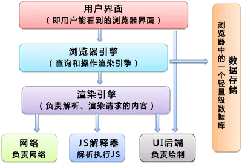
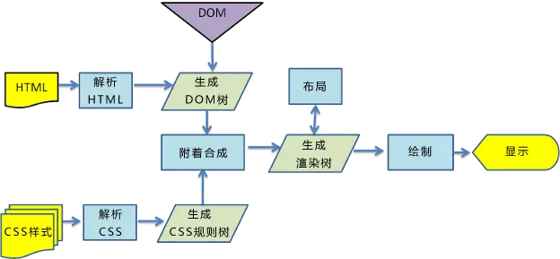

# Css 动画基础

## 浏览器的渲染机制

### 浏览器的主要组件结构



### webkit 的渲染引擎



### 关键渲染路径

关键渲染路径是指浏览器从最初接收请求来的 HTML、CSS、javascript 等资源,然后解析、构建树、渲染布局、绘制,最后呈现给客户能看到的界面这整个过程.
所以浏览器的渲染过程主要包括以下几步:

1. 解析 HTML 生成 DOM 树.
2. 解析 CSS 生成 CSSOM 规则树.
3. 将 DOM 树与 CSSOM 规则树合并在一起生成渲染树.
4. 遍历渲染树开始布局,计算每个节点的位置大小信息.
5. 将渲染树每个节点绘制到屏幕.

#### 构建 DOM 树

当浏览器接收到服务器响应来的 HTML 文档后,会遍历文档节点,生成 DOM 树.需要注意的是,DOM 树的生成过程中可能会被 CSS 和 JS 的加载执行阻塞.

#### 构建 CSSOM 规则树

浏览器解析 CSS 文件并生成 CSS 规则树,每个 CSS 文件都被分析成一个 StyleSheet 对象,每个对象都包含 CSS 规则.CSS 规则对象包含对应于 CSS 语法的选择器和声明对象以及其他对象.

#### 渲染阻塞

当浏览器遇到一个 script 标记时,DOM 构建将暂停,直至脚本完成执行,然后继续构建 DOM.每次去执行 JavaScript 脚本都会严重地阻塞 DOM 树的构建,如果 JavaScript 脚本还操作了 CSSOM,而正好这个 CSSOM 还没有下载和构建,浏览器甚至会延迟脚本执行和构建 DOM,直至完成其 CSSOM 的下载和构建.所以,script 标签的位置很重要.实际使用时,可以遵循下面两个原则:

1. CSS 优先:引入顺序上,CSS 资源先于 JavaScript 资源.
2. JS 置后:我们通常把 JS 代码放到页面底部,且 JavaScript 应尽量少影响 DOM 的构建.

##### CSS

```css
<style> p { color: red; }</style>
<link rel="stylesheet" href="index.css">
```

这样的 link 标签（无论是否 inline）会被视为阻塞渲染的资源,浏览器会优先处理这些 CSS 资源,直至 CSSOM 构建完毕.

```css
<link href="index.css" rel="stylesheet">
<link href="print.css" rel="stylesheet" media="print">
<link href="other.css" rel="stylesheet" media=(min-width: 30em) and (orientation: landscape)
```

1. 第一个资源会加载并阻塞.
2. 第二个资源设置了媒体类型,会加载但不会阻塞,print 声明只在打印网页时使用.
3. 第三个资源提供了媒体查询,会在符合条件时阻塞渲染.

##### JavaScript

JavaScript 的情况比 CSS 要更复杂一些.观察下面的代码:

```html
<p>Do not go gentle into that good night,</p>
<script>
  console.log('inline');
</script>
<p>Old age should burn and rave at close of day;</p>
<script src="app.js"></script>
<p>Rage, rage against the dying of the light.</p>

<p>Do not go gentle into that good night,</p>
<script src="app.js"></script>
<p>Old age should burn and rave at close of day;</p>
<script>
  console.log('inline');
</script>
<p>Rage, rage against the dying of the light.</p>
```

这样的 script 标签会阻塞 HTML 解析,无论是不是 inline-script.上面的 P 标签会从上到下解析,这个过程会被两段 JavaScript 分别打断一次（加载并且执行的时间段内）.

所以实际工程中,**常常将资源放到文档底部**.

#### 改变阻塞模式

defer 与 async 可以解决 script 都阻塞 DOM 的渲染的问题.

##### defer

如果 script 标签设置了该属性,则浏览器会异步的下载该文件并且不会影响到后续 DOM 的渲染,**意味并行处理**,如果有多个设置了 defer 的 script 标签存在,则会按照顺序执行所有的 script,整个 document 解析完毕且 defer-script 也加载完成之后（这两件事情的顺序无关）,会执行所有由 defer-script 加载的 JavaScript 代码,然后触发 DOMContentLoaded 事件.

_defer 与相比普通 script,有两点区别_:

1. 载入 JavaScript 文件时不阻塞 HTML 的解析.
2. 执行阶段被放到 HTML 标签解析完成之后.

##### async

async 属性表示异步执行引入的 JavaScript,与 defer 的区别在于,如果已经加载好,就会开始执行——无论此刻是 HTML 解析阶段还是 DOMContentLoaded 触发之后.需要注意的是,这种方式加载的 JavaScript 依然会阻塞 load 事件.换句话说,async-script 可能在 DOMContentLoaded 触发之前或之后执行,但一定在 load 触发之前执行.

#### 构建渲染树

通过 DOM 树和 CSS 规则树我们便可以构建渲染树.浏览器会先从 DOM 树的根节点开始遍历每个可见节点.对每个可见节点,找到其适配的 CSS 样式规则并应用.渲染树构建完成后,每个节点都是可见节点并且都含有其内容和对应规则的样式.这也是渲染树与 DOM 树的最大区别所在.渲染树是用于显示,那些不可见的元素当然就不会在这棵树中出现了.

#### 渲染树布局

布局阶段会从渲染树的根节点开始遍历,然后确定每个节点对象在页面上的确切大小与位置,布局阶段的输出是一个盒子模型,它会精确地捕获每个元素在屏幕内的确切位置与大小.

#### 渲染树绘制

在绘制阶段,遍历渲染树,调用渲染器的 paint()方法在屏幕上显示其内容.渲染树的绘制工作是由浏览器的 UI 后端组件完成的.

#### 回流和重绘（reflow 和 repaint）

HTML 默认是流式布局的,但 CSS 和 JS 会打破这种布局,改变 DOM 的外观样式以及大小和位置.因此出现了两个概念:

- reflow（回流）:当浏览器发现某个部分发生了变化从而影响了布局,这个时候就需要倒回去重新渲染,这个回退的过程叫 reflow. 常见的 reflow 是一些会影响页面布局的操作,例如隐藏.reflow 会从 html 这个 `root frame` 开始递归往下,依次计算所有的结点几何尺寸和位置,以确认发生变化的是渲染树的一部分还是整个渲染树.reflow 几乎是无法避免的,因为只要用户进行交互操作,就势必会发生页面的一部分的重新渲染,且通常我们也无法预估浏览器到底会 reflow 哪一部分的代码,因为他们会相互影响.
- repaint（重绘）: repaint 则是当我们改变某个元素的背景色、文字颜色、边框颜色等等不影响它周围或内部布局的属性时,屏幕的一部分要重画,但是元素的几何尺寸和位置没有发生改变.

需要注意的是,display:none 会触发 reflow,而 visibility: hidden 属性则并不算是不可见属性,它的语义是隐藏元素,但元素仍然占据着布局空间,它会被渲染成一个空框,这在我们上面有提到过.所以 visibility:hidden 只会触发 repaint,因为没有发生位置变化.

reflow 无法避免,但还是能通过一些操作来减少回流:

1. 用 transform 做形变和位移.
2. 通过绝对位移来脱离当前层叠上下文,形成新的 Render Layer.

## Css 的动画实现方式

Css 的动画通常与三种属性相关,`animation` `transition` 跟 `transform`.

### transform

| 取值        | 描述     |
| ----------- | -------- |
| translate   | 位置移动 |
| scale       | 缩放     |
| rotate      | 旋转     |
| skew        | 倾斜     |
| perspective | 透视     |

`transform` 要应用的一个或多个 CSS 变换函数. 变换函数按从左到右的顺序相乘,这意味着复合变换按从右到左的顺序有效地应用.
**transform 多个属性变换,变换从左往右应用,顺序不同结果不同**
**`inline`元素不支持`transform` ,要先变成`block`.**

#### translate

translate 属性负责位移.取值为百分比或者长度

```css
<translate()> = translate( <translateX()>, <translateY()>[可省略]  )
<translateX()> = translateX( <length-percentage> )
<translateY()> = translateY( <length-percentage> )
<length-percentage> = <length> | <percentage>
```

**`translate(-50%,-50%)可做绝对定位元素的居中`**

#### scale

scale 属性负责缩放.取值为数字

```css
<scale()> = scale( <number> , <number>? )
<scaleX()> = scaleX( <number> )
<scaleY()> = scaleY( <number> )

<scale3d()> = scale3d( <number> , <number> , <number> )
<scaleZ()> = scaleZ( <number> )
```

#### rotate

rotate 属性负责旋转.取值为数值,角度,0

```css
<rotate3d()> = rotate3d( <number> , <number> , <number> , [ <angle> | <zero> ] )
<rotateX()> = rotateX( [ <angle> | <zero> ] )
<rotateY()> = rotateY( [ <angle> | <zero> ] )
<rotateZ()> = rotateZ( [ <angle> | <zero> ] )
```

**在 rotate3d 时可取数值型.**

#### skew

skew 属性负责倾斜.取值为角度,0

```css
<skew()> = skew( [ <angle> | <zero> ] , [ <angle> | <zero> ]? )
<skewX()> = skewX( [ <angle> | <zero> ] )
<skewY()> = skewY( [ <angle> | <zero> ] )
```

#### perspective

perspective 属性定义视角距离,取值为长度

`perspective( <length> )`

#### CSS matrix() 方法

### transition

transition CSS 属性是 `transition-property`,`transition-duration`,`transition-timing-function` 和 `transition-delay` 的一个简写属性.

| 属性                       | 内容                                        | 取值                    |
| -------------------------- | ------------------------------------------- | ----------------------- |
| transition-property        | 指定 CSS 属性的 name,transition 效果        | `none|all|IDENT属性名`  |
| transition-duration        | transition 效果需要指定多少秒或毫秒才能完成 | `默认值为 0s不显示动画` |
| transition-timing-function | 指定 transition 效果的转速曲线              | `<timing-function>`     |
| transition-delay           | 定义 transition 效果开始的时候              | `默认值为 0s无延迟`     |

```css
<timing-function> = linear | <cubic-bezier-timing-function> | <step-timing-function>

<cubic-bezier-timing-function> = ease | ease-in | ease-out | ease-in-out | cubic-bezier(<number>, <number>, <number>, <number>)

<step-timing-function> = step-start | step-end | steps(<integer>[, <step-position>]?)

<step-position> = jump-start | jump-end | jump-none | jump-both | start | end
```

[详细的曲线内容--Mdn](https://developer.mozilla.org/zh-cn/docs/web/css/timing-function)

### animation

CSS animation 属性是 `animation-name`,`animation-duration`, `animation-timing-function`,`animation-delay`,`animation-iteration-count`,`animation-direction`,`animation-fill-mode` 和 `animation-play-state` 属性的一个简写属性形式.

| 值                        | 说明                                                                                  |
| ------------------------- | ------------------------------------------------------------------------------------- |
| animation-name            | 指定要绑定到选择器的关键帧的名称                                                      |
| animation-duration        | 动画指定需要多少秒或毫秒完成                                                          |
| animation-timing-function | 设置动画将如何完成一个周期                                                            |
| animation-delay           | 设置动画在启动前的延迟间隔.                                                           |
| animation-iteration-count | 定义动画的播放次数.                                                                   |
| animation-direction       | 指定是否应该轮流反向播放动画.                                                         |
| animation-fill-mode       | 规定当动画不播放时（当动画完成时,或当动画有一个延迟未开始播放时）,要应用到元素的样式. |
| animation-play-state      | 指定动画是否正在运行或已暂停.                                                         |
| initial                   | 设置属性为其默认值.                                                                   |
| inherit                   | 从父元素继承属性.                                                                     |

#### @keyframes

`@keyframes` 规则通过在动画序列中定义关键帧的样式来控制 CSS 动画序列中的中间步骤.这比`Css transition`更能控制动画序列的中间步骤.

```css
@keyframes slidein {
  from {
    margin-left: 100%;
    width: 300%;
  }

  to {
    margin-left: 0%;
    width: 100%;
  }
}
```

如果一个关键帧规则没有指定动画的开始或结束状态（也就是,0%/from 和 100%/to,浏览器将使用元素的现有样式作为起始/结束状态.这可以用来从初始状态开始元素动画,最终返回初始状态.

## Css 动画的优化
