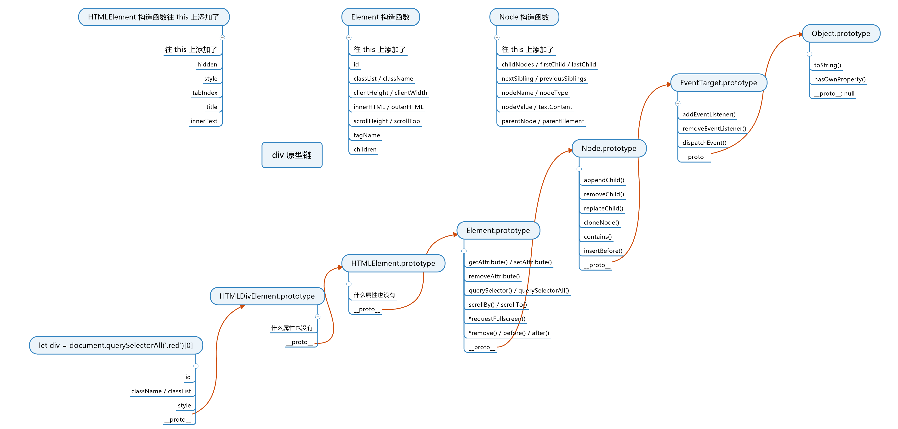

# DOM基础学习

## 什么是DOM

关于DOM(Document Object Model),Mdn给出了一个标准的定义：

> 文档对象模型 (DOM) 是HTML和XML文档的编程接口.它提供了对文档的结构化的表述,并定义了一种方式可以使从程序中对该结构进行访问,从而改变文档的结构,样式和内容.DOM 将文档解析为一个由节点和对象（包含属性和方法的对象）组成的结构集合.

换言之：DOM就是将文档解析成一个可操作的数据模型.DOM模型将文档解析成一颗可操作的树,树的每个分支的终点都是一个节点(node),每个节点都包含着对象(objects).DOM提供方法(methods)让你可以用特定方式操作这个树.

## 通过DOM获取元素(标签)

一个Html标签(Tag)在一棵DOM树中被识别为一个元素(element).  **`tag===element`**

### 获取一般元素

1. 通过ID获取（getElementById || id）
2. 通过name属性（getElementsByName）
3. 通过标签名（getElementsByTagName）
4. 通过类名（getElementsByClassName）
5. 通过选择器获取一个元素（querySelector）
6. 通过选择器获取一组元素（querySelectorAll）

```javascript
document.getElementById('id')//多个ID重复只返回第一个
document.getElementsByName('name')//返回值是一个伪数组,没有找到返回空数组
document.getElementsByTagName('TagName');//返回值是一个伪数组,没有找到返回空数组
document.getElementsByClassName('ClassName');//返回值是一个伪数组,没有找到返回空数组
document.querySelector('Css选择器');
parentNode.querySelectorAll('Css选择器');//上下文可以自定义,返回值是一个伪数组,没有找到返回空数组
```

### 获取特定元素

1. Html：`document.documentElement`
2. Head:`document.head`
3. Body:`document.body`
4. 页面所有元素的集合：`document.all`(特殊`falsy`值)

窗口对象 ==>  `window`

### DOM元素引出的原型链[6级]



```javascript
实例对象：div#logo 原型↓ 
__proto__: HTMLDivElement
__proto__: HTMLElement
__proto__: Element
__proto__: Node
__proto__: EventTarget
__proto__: Object
```

### Node节点

>  Node.nodeType 表示的是该节点的类型.

nodeType 属性可用来区分不同类型的节点,比如 元素, 文本 和 注释.

| 节点类型值 | 描述                              |
| ---------- | --------------------------------- |
| 1          | 一个 元素 节点,例如`<p>`和`<div>` |
| 3          | Element 或者 Attr 中实际的  文字  |
| 8          | 一个 Comment 节点.                |
| 9          | 一个 Document 节点.               |
| 10         | 描述文档类型的 DocumentType 节点. |
| 11         | 一个 DocumentFragment 节点        |

### 增删改查

#### 增加

##### 创建一个标签节点(Node===1)
`let tagElement=document.createElement('tagName');`
##### 创建一个文本节点(Node===3)
`let TextElement=document.createTextNode('data');`
##### 标签内插入文本
```javascript
let div=document.createElement('div');
let data=document.createTextNode('data');
//通过后继元素插入
div.appendChild(data)
//直接写入
div.innerText='data-Text'
div.textContent='data-content'
```
##### 节点插入页面中
`页面内元素.appendChild(待插入节点)`
**appendChild()** 函数插入的节点是唯一的，只能存在一份，不能同时插入两个元素的后继。


#### 删除
##### 删除一个节点
```javascript
//自己删自己
childNode.remove()
//删除的节点元素仍旧存在于内存中，可以重新添加。
```
#### 修改
##### 改节点属性
```javascript
//Class
div.className//以字符串显示class "green"
div.classList//以字符串显示class ["green", value: "green"]
div.className +=' green' 
div.classList.add('blue')
//Style
logo.style='background-color:red;'//修改整个Style
logo.style.backgroundColor='green'  //修改部分Style，遇到-号转化为大写字母
//data-*
logo.dataset.x='自定义属性'
```
##### 读节点属性
`节点.属性`||`节点.getAttribute('属性')`
##### 节点事件
设置事件：`节点.onclick=function(){}`
监听事件：`节点.addEventListener()`

#### 节点
##### 改文本
`节点.innerText='data-Text'`
`节点.textContent='data-content'`
##### 改Html
`节点.innerHTML='<h1>data-Text</h1>'`
##### 改子节点
`节点.innerText=' '`
`节点.appendChild(待插入节点)`
##### 改父节点
`新父节点.appendChild(待修改节点)`

#### 查询
##### 查父节点
`logo.parentNode || logo.parentElement`
##### 查子节点
**子代变化时，查询的值实时变化**
`logo.children 只有标签`
`logo.childNodes 包含所有节点`
##### 查兄弟节点
`logo.previousSibling`
`logo.nextSibling`

##### 遍历整个结点
```javascript
//只要存在子节点就遍历子节点，并执行fn
travel = (node, fn) => {
  fn(node);
  if (node.children) {
    for (let i = 0; i < node.children.length; i++) {
      travel(node.children[i], fn);
    }
  }
};
```


### DOM操作跨线程

在了解DOM的操作为什么是跨线程之前,先来补充一波基础的知识.屏蔽掉浏览器的复杂,作为一个前端人员,目前我们假设浏览器就只有一个内核,内核内只运行一个进程那就是渲染进程.就一个单独渲染进程来说,它本身是多线程的.假设只包含两个线程.

1. GUI渲染线程
- 负责渲染页面,布局和绘制
- 页面需要重绘和回流时,该线程就会执行
- 与js引擎线程互斥,防止渲染结果不可预期
2. JS引擎线程
- 负责处理解析和执行javascript脚本程序
- 只有一个JS引擎线程（单线程）
- 与GUI渲染线程互斥,防止渲染结果不可预期

了解了基本信息,来看看一次DOM操作究竟发生了什么？

1. 修改了对象的属性==>JS引擎在内存中修改了对象的属性
2. 将对象添加到页面上==>JS引擎读取到后通知浏览器
3. 浏览器通知GUI渲染线程(耗时)
4. GUI渲染线程渲染对应对象的元素
5. GUI渲染线程根据元素要渲染的属性的不同,可能造成回流和重绘(reflow 和 repaint)或者layout

但是并不是所有的属性都会在修改后同步到页面上：
对于**标准属性**和 **`data-*`** 属性一定会被同步到页面.对于自定义属性只会留在JS线程中.


#### Property 和 Attribute

对于Js线程中的对象的属性,称为 Property,对于GUI渲染线程中的元素的属性,称为 Attribute.
