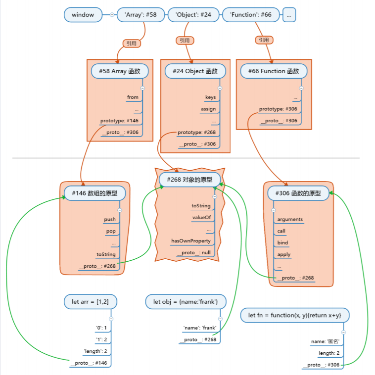

# Js世界的构造

1. 最开始，Js引擎构造出一个**根对象**。它是所有对象(直接或间接)的原型。
2. 紧接着，Js引擎构造出**函数的原型**和**数组的原型**。
3. Js引擎将**函数的原型**的__proto__指向**根对象**(因为函数的原型本身是一个无名的对象)。
4. Js引擎将**数组的原型**的__proto__指向**根对象**(因为数组的原型本身是一个无名的对象)。
5. 现在 根对象，函数的原型，数组的原型 都存在了。Js引擎开始构造所有函数的构造函数==>Function。
6. Js引擎将Function的prototype指向**函数的原型**(因为Function是函数的构造函数，所以它的原型指向**函数的原型**)。
7. Js引擎将Function的__proto__指向**函数的原型**(因为Function本身是由**函数的原型**构造出来的)。
8. 完成以上工作后。Js引擎通过Function构造==>对象的构造函数(Object)和数组的构造函数(Array)。
9. Js引擎将Object的prototype指向**对象的原型**(因为Object是对象的构造函数，所以它的原型指向**对象的原型(根对象)**)。
10. Js引擎将Object的__proto__指向**函数的原型**(因为Object本身是由Function构造出来的，所以Object.__proto__===Function.prototype===**函数的原型**)。
11. Js引擎将Array的prototype指向**数组的原型**(因为Array是数组的构造函数，所以它的原型指向**数组的原型**)。
12. Js引擎将Array的__proto__指向**函数的原型**(因为Array本身是由Function构造出来的，所以Array.__proto__===Function.prototype===**函数的原型**)。
13. Js引擎创建window对象。
14. Js引擎将Object和Array挂载到window对象上。