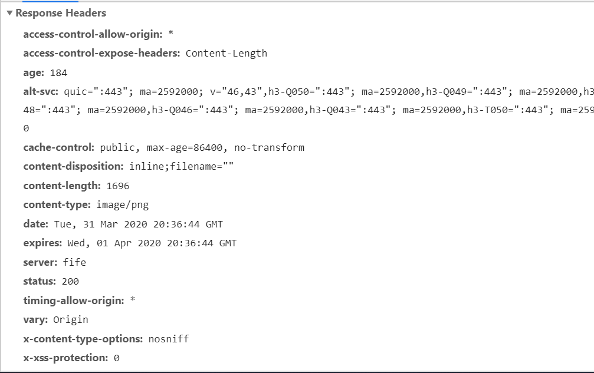
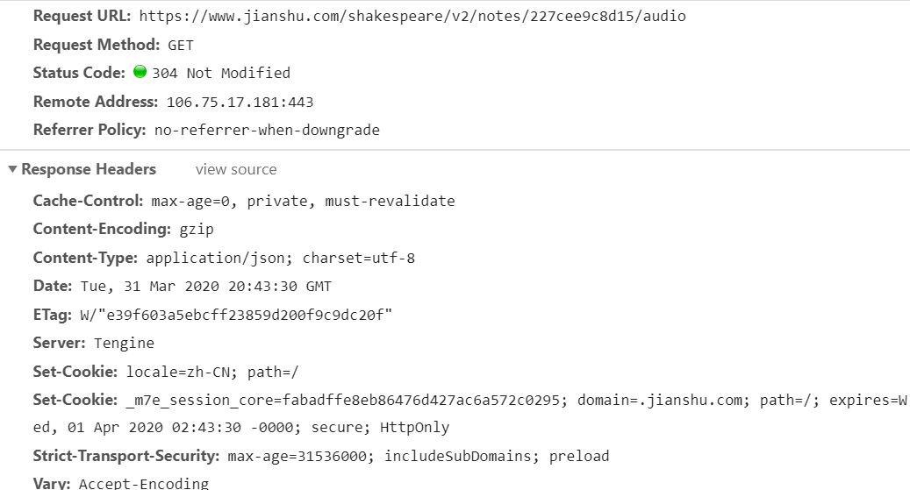
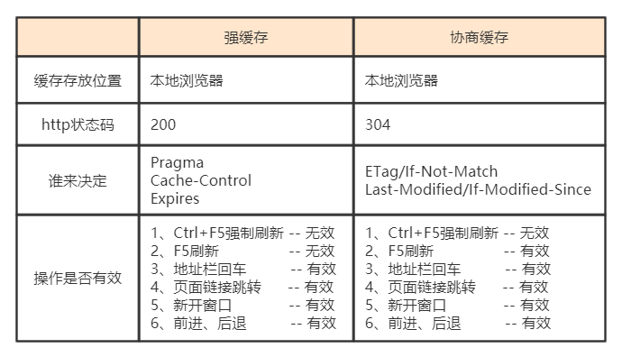

# HTTP缓存机制详解

## 什么是HTTP缓存?

当客户端向服务器请求资源时，会先抵达浏览器缓存，如果浏览器有`要请求资源`的副本，就可以直接从浏览器缓存中提取而不是从原始服务器中提取这个资源。
常见的HTTP缓存只能缓存GET请求响应的资源，对于其他类型的响应则无能为力，所以后续说的请求缓存都是指GET请求。

HTTP缓存都是从第二次请求开始的。
1. 第一次请求资源时，服务器返回资源，并在`respone headers`中回传资源的缓存参数；
2. 第二次请求时，浏览器判断这些请求参数，命中强缓存就直接200，否则就把请求参数加到request header头中传给服务器，看是否命中协商缓存，命中则返回304，否则服务器会返回新的资源。

### HTTP缓存的分类

1. 根据是否可以被单个或者多个用户使用来分类，可分为(私有缓存，共享缓存)
2. 根据是否需要重新向服务器发起请求来分类，可分为(强制缓存，协商缓存) 
    - 强制缓存如果生效，不需要再和服务器发生交互(优先级高，先判断强缓存是否命中)
    - 而协商缓存不管是否生效，都需要与服务端发生交互。

#### 两种缓存方式对比

##### 强制缓存(200)
强制缓存在缓存数据未失效的情况下（即Cache-Control的max-age没有过期或者Expires的缓存时间没有过期），那么就会直接使用浏览器的缓存数据，不会再向服务器发送任何请求。强制缓存生效时，http状态码为200。这种方式页面的加载速度是最快的，性能也是很好的，但是在这期间，如果服务器端的资源修改了，页面上是拿不到的，因为它不会再向服务器发请求了。
跟强制缓存相关的header头属性有（Pragma/Cache-Control/Expires）

1. Pragma的优先级是最高的，但是在HTTP1.1中被废弃。**弃用**
2. 其次生效的是Cache-Control，Cache-Control 可以由多个字段组合而成，主要有以下几个取值：
   - `max-age` 指定一个时间长度，在这个时间段内缓存是有效的，单位是s。
   - `s-maxage` 指定一个时间长度，覆盖 max-age、Expires，但仅适用于共享缓存，在私有缓存中被忽略。
   - `no-cache` 强制所有缓存了该响应的用户，在使用已缓存的数据前，发送带验证器的请求到服务器。
   - `no-store `禁止缓存，每次请求都要向服务器重新获取数据。
   - `only-if-cached`: 表示不检索新的数据。客户端只希望获得缓存的响应，而不应该联系原始服务器来查看是否存在新的副本。
   - `must-revalidate`: 在缓存内容过期之后，缓存必须去源服务器进行新鲜度验证。
   - `immutable`: 表示在过期之前，资源不会随着时间改变。因此客户端不会发送条件请求来进行新鲜度验证。
   - public 表明响应可以被任何对象（发送请求的客户端、代理服务器等等）缓存。
   - private 表明响应只能被单个用户（可能是操作系统用户、浏览器用户）缓存，是非共享的，不能被代理服务器缓存。
3. Expires 指缓存过期的时间，超过了这个时间点就代表资源过期。由于使用具体时间，如果时间表示出错或者没有转换到正确的时区都可能造成缓存生命周期出错。
  - Expires的值是一个是一个日期的绝对值，再此日期之前，资源都被认为是新鲜的, 如果Expires的值为0.那么认为资源已经过期了。

#### 协商缓存(304)

协商缓存的条件是满足以下任意一条就会触发:
1. 当第一次请求时服务器返回的响应头中没有Cache-Control和Expires
2. Cache-Control和Expires过期
3. Cache-Control的属性设置为no-cache时(即不走强缓存)

那么浏览器第二次请求时就会与服务器进行协商，与服务器端对比判断资源是否进行了修改更新。如果服务器端的资源没有修改，那么就会返回304状态码，告诉浏览器可以使用缓存中的数据，这样就减少了服务器的数据传输压力。如果数据有更新就会返回200状态码，服务器就会返回更新后的资源并且将缓存信息一起返回。
跟协商缓存相关的header头属性有（ETag/If-Not-Match 、Last-Modified/If-Modified-Since）**请求头和响应头需要成对出现**

Last-modified/If-Modified-Since
Last-modified: 服务器端资源的最后修改时间，响应头部会带上这个标识。第一次请求之后，浏览器记录这个时间，再次请求时，请求头部带上 If-Modified-Since 即为之前记录下的时间。服务器端收到带 If-Modified-Since 的请求后会去和资源的最后修改时间(Last-modified)对比。若修改过就返回最新资源，状态码 200，若没有修改过则返回 304。

**如果响应头中有 Last-modified 而没有 Expire 或 Cache-Control 时，浏览器会有自己的算法来推算出一个时间缓存该文件多久，不同浏览器得出的时间不一样，所以 Last-modified 要记得配合 Expires/Cache-Control 使用。**

Etag/If-None-Match
由服务器端上生成的一段 hash 字符串，第一次请求时响应头带上 ETag: abcd，之后的请求中带上 If-None-Match: abcd，服务器检查 ETag，返回 304 或 200。

##### last-modified 和 Etag 区别
1. Last-modified 只能精确到秒，某些服务器不能精确得到资源的最后修改时间，这样就无法通过最后修改时间判断资源是否更新。
2. 一些资源的最后修改时间改变了，但是内容没改变，使用 Last-modified 看不出内容没有改变。
3. Etag 的精度比 Last-modified 高，属于强验证，要求资源字节级别的一致，优先级高。

兼容性：
在Firefox浏览器下，使用Cache-Control: no-cache 是不生效的，其识别的是no-store。这样能达到其他浏览器使用Cache-Control: no-cache的效果。所以为了兼容Firefox浏览器，经常会写成Cache-Control: no-cache，no-store。

